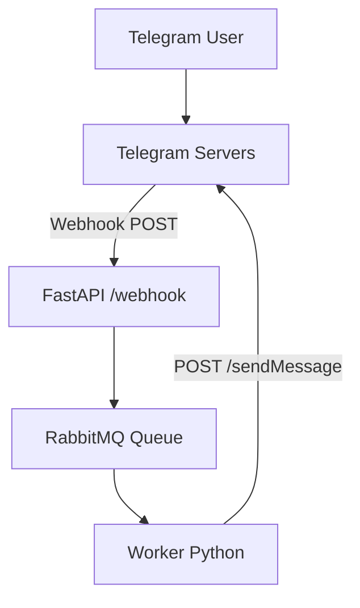

# 📈 Optifeed

**Optifeed** is an **intelligent Telegram bot** built to:

- **spot investment opportunities** from financial news and macro events,
- deliver **strategic and macroeconomic insights**,
- and eventually evolve into a **fully autonomous trading system**.

It follows an **event-driven, modular architecture**, with future integrations planned for:

- **LLM (Gemini)** to perform deep semantic analysis,
- a **vector database** for similarity search across news & reports,
- and a **knowledge graph** for structured financial reasoning.

---

## 🚀 Architecture overview



✅ The bot operates through a robust pipeline:

1. **Webhook (Telegram → FastAPI):** instantly receives user messages.
2. **FastAPI → RabbitMQ:** queues the request for asynchronous processing.
3. **RabbitMQ → Worker:** consumes tasks, runs vector searches + LLM analysis.
4. **Worker → Telegram:** sends polished responses back to the user.

---

## ⚙️ Tech stack

- **Python 3.10+**
- **FastAPI:** HTTP server handling Telegram webhooks
- **RabbitMQ** (via Docker): task queue broker
- **ChromaDB:** for future semantic vector search
- **Gemini API:** advanced LLM-driven analysis
- **ngrok:** for local development to expose FastAPI

---

## 🛠️ Local development

### 🚀 Prerequisites

- Python ≥3.10
- Docker + docker-compose
- ngrok (or cloudflared tunnel)

---

### 🔥 Start your stack

```bash
# Clone the repo & install Python deps
git clone https://github.com/your-user/optifeed.git
cd optifeed
uv sync
source .venv/bin/activate

# Start RabbitMQ
docker-compose up -d

# Launch FastAPI server
cd src && uvicorn api.app:app --reload --host 0.0.0.0 --port 8000

# Expose FastAPI via ngrok
ngrok http 8000
```

---

### 🔗 Register your Telegram webhook

Replace `NGROK_URL` with your actual ngrok HTTPS endpoint:

```bash
curl -X POST "https://api.telegram.org/bot<YOUR_TOKEN>/setWebhook" -d "url=https://NGROK_URL/webhook"
```

---

### 🚀 Start the worker

```bash
python worker/worker.py
```

---

## ✅ Typical flow

1. A user sends a command like:

```
/ask something
```

2. Telegram POSTs it to `/webhook`.
3. FastAPI queues a task in RabbitMQ.
4. The worker picks it up, does vector + LLM analysis.
5. The bot replies:

```
✅ Bot: I received your query "something". Here's what I found...
```

---

## 🚀 Roadmap & next steps

- [x] FastAPI + Telegram webhook integration
- [x] Async task processing via RabbitMQ
- [ ] Integration with Chroma for vector similarity
- [ ] Rich contextual analysis with Gemini
- [ ] Knowledge graph (Neo4j) for structured market reasoning
- [ ] Deployment on Raspberry Pi 5 with HTTPS via certbot

---

## 🤝 Contributions

If you have cool ideas around financial NLP, sentiment scoring, or want to integrate more data sources — feel free to open an issue or PR!
