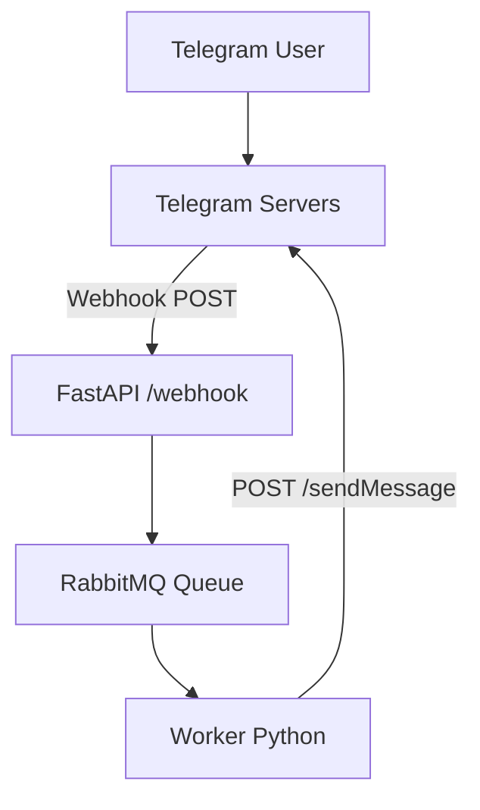

# 📈 Optifeed

This project is an **intelligent Telegram bot**, designed to:
- **identify investment opportunities** based on financial news and macro events,
- provide **strategic or macroeconomic insights**,
- and eventually evolve into a **fully autonomous trading bot**.

It uses an **event-driven, modular architecture**, with plans to integrate:
- a **LLM (Gemini)** for semantic analysis,
- a **vector database** for similarity search over news & reports,
- and eventually a **knowledge graph** for structured reasoning.

---

## 🚀 Architecture diagram



✅ The bot runs through a pipeline:
1. **Webhook (Telegram → FastAPI):** receives user messages instantly.
2. **FastAPI → RabbitMQ:** pushes the task to a queue for async processing.
3. **RabbitMQ → Worker:** consumes tasks, runs vector search + Gemini.
4. **Worker → Telegram:** sends the final response to the user.

---

## ⚙️ Tech stack

- **Python 3.10+**
- **FastAPI:** HTTP server for Telegram webhooks
- **RabbitMQ** (via Docker): message broker for task queueing
- **Chroma / Qdrant:** vector database for semantic similarity
- **Gemini (API):** for advanced LLM-driven analysis
- **ngrok** (local dev): to expose your FastAPI server publicly

---

## 🛠️ Running locally

### 🚀 Prerequisites
- Python ≥3.10
- Docker + docker-compose
- ngrok (or cloudflared tunnel)

---

### 🔥 Start services

```bash
# Clone the repo and install dependencies
git clone https://github.com/your-user/trading_bot.git
cd trading_bot
python -m venv .venv
source .venv/bin/activate
pip install -r requirements.txt

# Start RabbitMQ
docker-compose up -d

# Launch FastAPI
uvicorn fastapi_app.app:app --reload --host 0.0.0.0 --port 8000

# Start ngrok to expose your webhook
ngrok http 8000
```

---

### 🔗 Set up your Telegram webhook
Replace `NGROK_URL` with the URL displayed by ngrok:

```bash
curl -X POST   "https://api.telegram.org/bot<YOUR_TOKEN>/setWebhook"   -d "url=https://NGROK_URL/webhook"
```

---

### 🚀 Start the worker
```bash
python worker/worker.py
```

---

## ✅ Example workflow

- A user sends a message to your bot:
```
/health_check
```
- Telegram pushes a POST to `/webhook`.
- FastAPI enqueues a task in RabbitMQ.
- The worker picks up the task, runs a vector search + calls Gemini.
- Sends a reply back:
```
✅ Bot: I received your query «/health_check».
```

---

## 🚀 Roadmap & next steps

- [x] FastAPI + Telegram webhook integration
- [x] RabbitMQ for asynchronous task processing
- [ ] Integration with Chroma for vector search
- [ ] Contextual analysis with Gemini
- [ ] Adding a knowledge graph (Neo4j) for structured reasoning
- [ ] Deploy on Raspberry Pi 5 with certbot + native HTTPS

---
